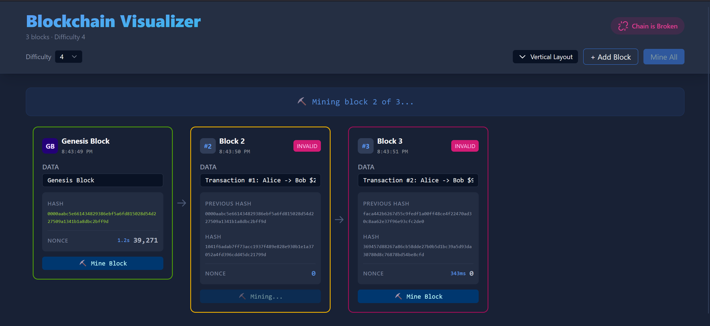
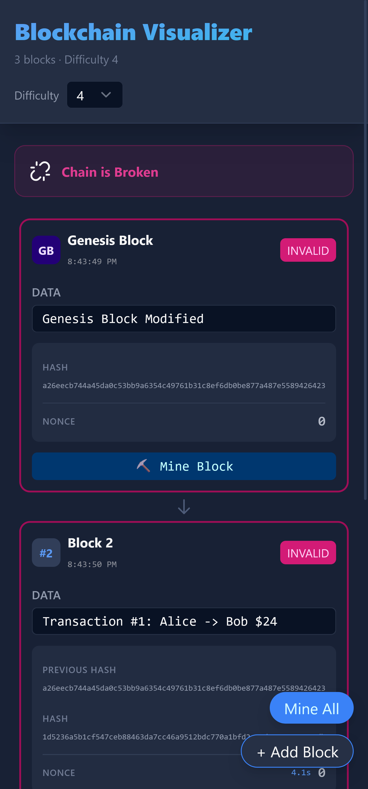

# Blockchain Visualizer

A stunning, interactive web application that visualizes how blockchain technology works. Built with Svelte 5, this educational tool demonstrates the fundamental concepts of blockchain including cryptographic hashing, proof-of-work mining, and chain integrity validation.


*Desktop view with horizontal layout showing the complete blockchain*


*Mobile-responsive vertical layout with floating action buttons*

## Features

### Core Features
- **Visual Blockchain Display** - Each block displays all essential fields:
  - Block number with special Genesis Block indicator
  - Timestamp showing when the block was created
  - Editable data field for transaction information
  - Previous block's hash (cryptographically linked)
  - Nonce value showing proof-of-work attempts
  - Current block hash with validity color coding

- **Interactive Mining** - Experience real proof-of-work mining:
  - Live mining animation with nonce updates
  - Mining time display (milliseconds to seconds)
  - Adjustable difficulty (1-4 leading zeros)
  - Progress indicators during mining operations
  - Auto-mine feature to mine all blocks sequentially

- **Chain Validation** - Real-time integrity checking:
  - Green borders indicate valid blocks with correct hash difficulty
  - Red borders highlight invalid or tampered blocks
  - Yellow borders show blocks currently being mined
  - Cascading validation shows how tampering affects downstream blocks

- **Tampering Demonstration** - Visualize blockchain immutability:
  - Edit any block's data field to simulate tampering
  - Watch the hash instantly become invalid
  - See how tampering breaks all subsequent blocks
  - Red borders cascade through the broken chain
  - Demonstrates why blockchain is tamper-evident

- **Batch Mining** - Efficiently mine multiple blocks:
  - Auto-mine all invalid blocks in sequence
  - Real-time progress updates during batch operations
  - Individual mining time tracking per block
  - Can be cancelled mid-operation

- **Visual Hash Linking** - Understand cryptographic connections:
  - Directional arrows show block relationships
  - Clear visual flow from genesis to latest block
  - Animated connections respond to layout changes
  - Helps visualize the "chain" in blockchaintomatically
  - Shows progress for each block

## Getting Started

### Prerequisites
- Node.js (v16 or higher)
- npm or yarn

### Installation

1. Clone the repository:
```bash
git clone https://github.com/chdean-09/blockchain-visualizer.git
cd blockchain-visualizer
```

2. Install dependencies:
```bash
npm install
```

3. Run the development server:
```bash
npm run dev
```

4. Open your browser and navigate to:
```
http://localhost:5173/blockchain-visualizer/
```

## Technology Stack

- **Framework**: Svelte
- **Build Tool**: Vite
- **Cryptography**: crypto-js (SHA-256)
- **Styling**: Tailwind CSS
- **UI framework** - Skeleton.dev uniform design language

## 📜 License

MIT License - Feel free to use this for educational purposes!
